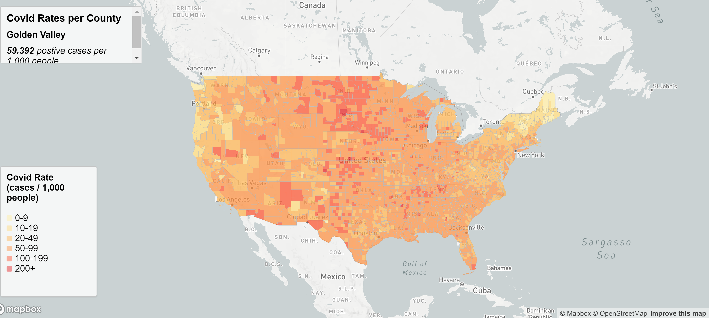
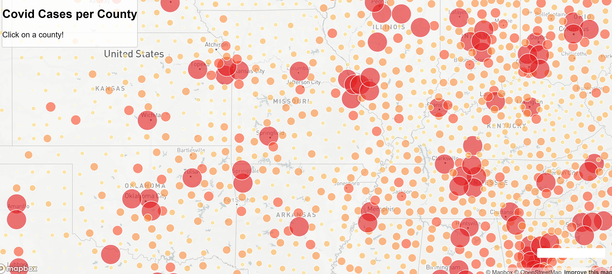

# US-Covid-Cases

Includes two maps visualizing the covid rates and cases per U.S. county.

## Covid rates map

The first map included, can be found at map1.html. This map shows the viewer a choropleth map of the covid rates per U.S. County. A feature on this map is that the user is able to hover over a county to see a pop up of the rate.

## Covid counts map

The second map included is map2.html. This is a dot density map by U.S. county visualizing the number of cases by county. A feature of this map is that the user is able to click on an individual dot in order to see the exact number of cases.

## Data

The COVID-19 case/death data is from The New York Times. The population data used is from the 2018 ACS 5 year estimates. The U.S. County Shapefile was downloaded from the U.S. Census Bureau. The data has additionally been processed by Steven Bao and University of Washington Geog 458 TAs.
